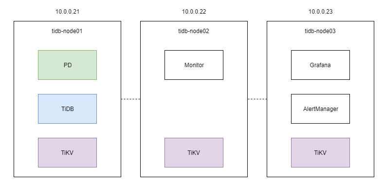
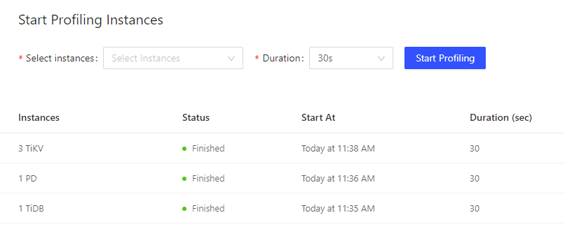
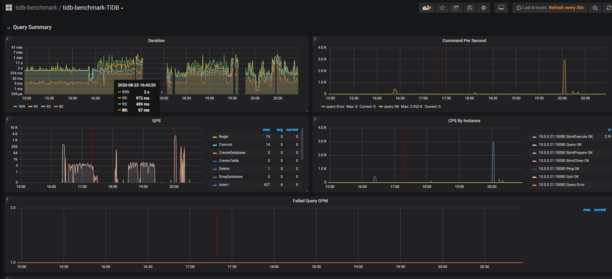
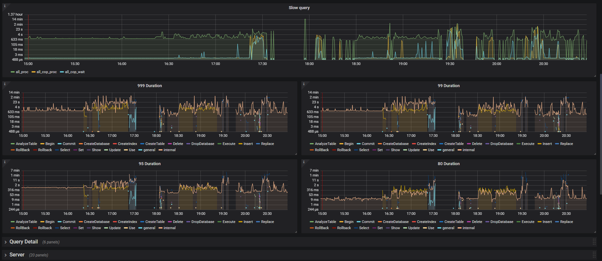
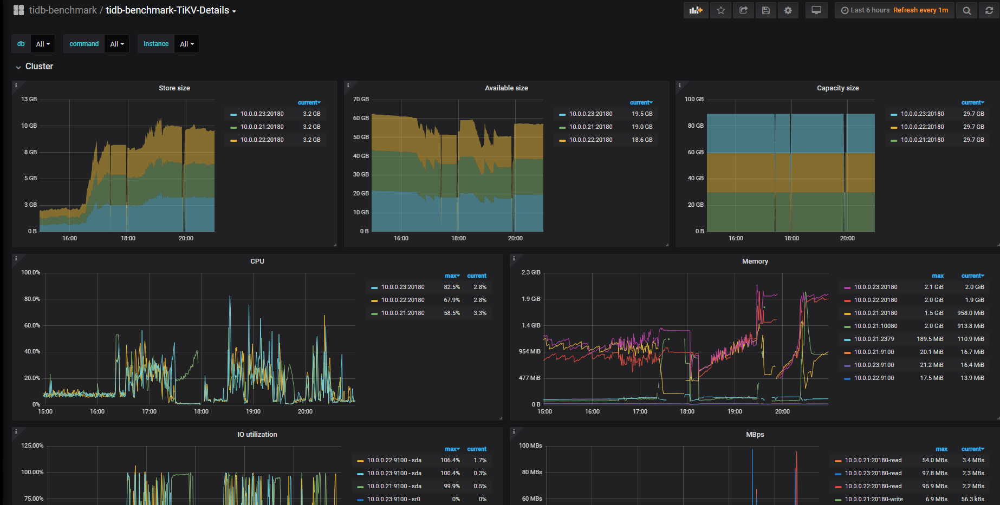
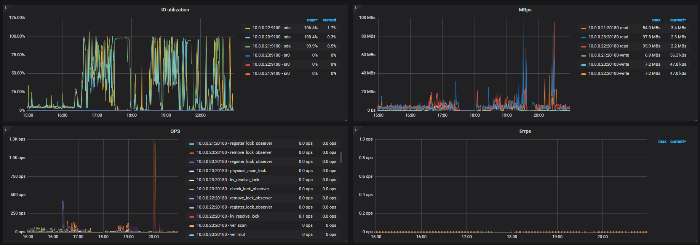
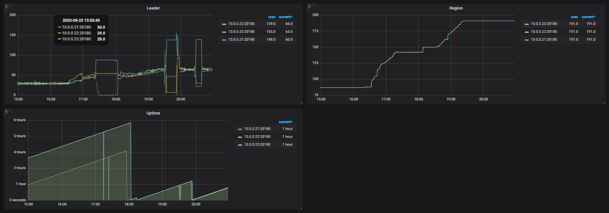
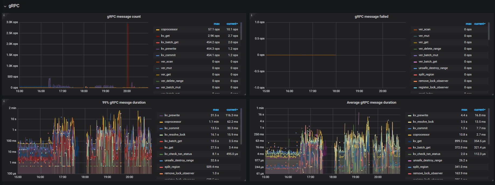
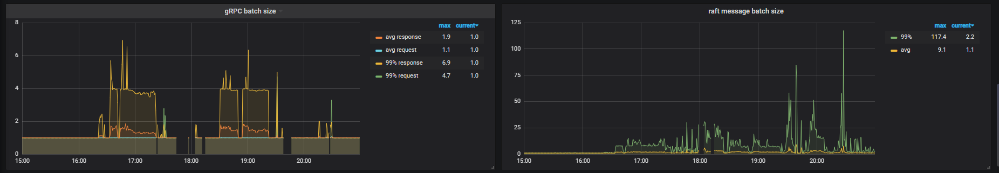

# Lesson02 对 TiDB 进行基准性能测试

## 使用 TiUP 安装集群
安装环境说明：

- 准备三台虚拟机，内存3G，磁盘28G。
   - tidb-node01：10.0.0.21
   - tidb-node02：10.0.0.22
   - tidb-node03：10.0.0.23
- 对用户 admin 做SSH免密配置，且配置好 `admin ALL = NOPASSWD: ALL`
- 为了端口通信自由，关闭了防火墙

部署图




topology.yml（去掉注释）

```yaml
global:
  user: "tidb"
  ssh_port: 22
  deploy_dir: "/tidb-deploy"
  data_dir: "/tidb-data"
  arch: "amd64" # Supported values: "amd64", "arm64" (default: "amd64")

monitored:
  node_exporter_port: 9100
  blackbox_exporter_port: 9115

server_configs:
  tidb:
    log.slow-threshold: 300
    binlog.enable: false
    binlog.ignore-error: false
  tikv:
    readpool.storage.use-unified-pool: false
    readpool.coprocessor.use-unified-pool: true
  pd:
    schedule.leader-schedule-limit: 4
    schedule.region-schedule-limit: 2048
    schedule.replica-schedule-limit: 64
  tiflash:
    logger.level: "info"
  tiflash-learner:
    log-level: "info"

  pump:
    gc: 7

pd_servers:
  - host: 10.0.0.21

tidb_servers:
  - host: 10.0.0.21

tikv_servers:
  - host: 10.0.0.21
  - host: 10.0.0.22
  - host: 10.0.0.23


monitoring_servers:
  - host: 10.0.0.22

grafana_servers:
  - host: 10.0.0.23

alertmanager_servers:
  - host: 10.0.0.23
```


安装：

> 安装用户 admin 必须为 sudoer
> 且配置了 admin ALL = NOPASSWD: ALL

```shell
tiup cluster deploy tidb-benchmark nightly ./topology.yml --user admin
```

启动集群：

```shell
tiup cluster start tidb-benchmark
```

查看集群列表：

```shell
$ tiup cluster display tidb-benchmark
Starting component `cluster`: /home/admin/.tiup/components/cluster/v1.0.9/tiup-cluster display tidb-benchmark
tidb Cluster: tidb-benchmark
tidb Version: nightly
ID               Role          Host       Ports        OS/Arch       Status   Data Dir                      Deploy Dir
--               ----          ----       -----        -------       ------   --------                      ----------
10.0.0.23:9093   alertmanager  10.0.0.23  9093/9094    linux/x86_64  Up       /tidb-data/alertmanager-9093  /tidb-deploy/alertmanager-9093
10.0.0.23:3000   grafana       10.0.0.23  3000         linux/x86_64  Up       -                             /tidb-deploy/grafana-3000
10.0.0.21:2379   pd            10.0.0.21  2379/2380    linux/x86_64  Up|L|UI  /tidb-data/pd-2379            /tidb-deploy/pd-2379
10.0.0.22:9090   prometheus    10.0.0.22  9090         linux/x86_64  Up       /tidb-data/prometheus-9090    /tidb-deploy/prometheus-9090
10.0.0.21:4000   tidb          10.0.0.21  4000/10080   linux/x86_64  Up       -                             /tidb-deploy/tidb-4000
10.0.0.21:20160  tikv          10.0.0.21  20160/20180  linux/x86_64  Up       /tidb-data/tikv-20160         /tidb-deploy/tikv-20160
10.0.0.22:20160  tikv          10.0.0.22  20160/20180  linux/x86_64  Up       /tidb-data/tikv-20160         /tidb-deploy/tikv-20160
10.0.0.23:20160  tikv          10.0.0.23  20160/20180  linux/x86_64  Up       /tidb-data/tikv-20160         /tidb-deploy/tikv-20160
```

- 访问 dashboard：http://10.0.0.21:2379/dashboard
  - 默认登录用户名密码：root/ no password

- 访问 Grafana 的账号密码：admin/admin


MySQL 客户端访问：

```shell
$ mysql -h tidb-node01 -P 4000 -u root
```


## Profile Instances

各个节点实例，Profile 看看调用情况：




## Sysbench

安装 sysbench：

```shell
$ curl -s https://packagecloud.io/install/repositories/akopytov/sysbench/script.rpm.sh | sudo bash
$ sudo yum -y install sysbench
```


### 准备导入数据

创建数据库

```shell
> create database sbtest;
```

导入数据之前先设置为乐观事务模式，导入结束后再设置回悲观模式

```shell
> set global tidb_disable_txn_auto_retry = off;
> set global tidb_txn_mode="optimistic";
```

导入数据(每个表10万条数据)

```shell
$ sysbench --config-file=sysbench_config oltp_point_select --threads=3 --tables=16 --table-size=100000 prepare
```

> 由于实验环境限制，100万条数据插入，让 TiDB 整体变得不稳定。经常插入执行失败，因此数据量降低为 10万条。
 
### 测试性能

#### 测试点查性能

```shell
$ sysbench --config-file=sysbench_config oltp_point_select --threads=3 --tables=16 --table-size=100000 run
```

结果：

```
[ 10s ] thds: 3 tps: 449.53 qps: 449.53 (r/w/o: 449.53/0.00/0.00) lat (ms,95%): 25.28 err/s: 0.00 reconn/s: 0.00
[ 20s ] thds: 3 tps: 1185.85 qps: 1185.85 (r/w/o: 1185.85/0.00/0.00) lat (ms,95%): 7.56 err/s: 0.00 reconn/s: 0.00
[ 30s ] thds: 3 tps: 1601.26 qps: 1601.26 (r/w/o: 1601.26/0.00/0.00) lat (ms,95%): 4.57 err/s: 0.00 reconn/s: 0.00
[ 40s ] thds: 3 tps: 2207.11 qps: 2207.11 (r/w/o: 2207.11/0.00/0.00) lat (ms,95%): 2.91 err/s: 0.00 reconn/s: 0.00
[ 50s ] thds: 3 tps: 2024.92 qps: 2024.92 (r/w/o: 2024.92/0.00/0.00) lat (ms,95%): 3.55 err/s: 0.00 reconn/s: 0.00
[ 60s ] thds: 3 tps: 2488.32 qps: 2488.32 (r/w/o: 2488.32/0.00/0.00) lat (ms,95%): 2.52 err/s: 0.00 reconn/s: 0.00
[ 70s ] thds: 3 tps: 1849.22 qps: 1849.22 (r/w/o: 1849.22/0.00/0.00) lat (ms,95%): 3.62 err/s: 0.00 reconn/s: 0.00
[ 80s ] thds: 3 tps: 1098.55 qps: 1098.55 (r/w/o: 1098.55/0.00/0.00) lat (ms,95%): 11.04 err/s: 0.00 reconn/s: 0.00
[ 90s ] thds: 3 tps: 2445.71 qps: 2445.71 (r/w/o: 2445.71/0.00/0.00) lat (ms,95%): 2.52 err/s: 0.00 reconn/s: 0.00
```

#### 测试更新索引性能

```shell
$ sysbench --config-file=sysbench_config oltp_update_index --threads=3 --tables=16 --table-size=100000 run
```

结果：

```
[ 10s ] thds: 3 tps: 220.17 qps: 220.17 (r/w/o: 0.00/220.17/0.00) lat (ms,95%): 27.66 err/s: 0.00 reconn/s: 0.00
[ 20s ] thds: 3 tps: 211.39 qps: 211.39 (r/w/o: 0.00/211.39/0.00) lat (ms,95%): 30.81 err/s: 0.00 reconn/s: 0.00
[ 30s ] thds: 3 tps: 210.71 qps: 210.71 (r/w/o: 0.00/210.71/0.00) lat (ms,95%): 33.12 err/s: 0.00 reconn/s: 0.00
[ 40s ] thds: 3 tps: 277.50 qps: 277.50 (r/w/o: 0.00/277.50/0.00) lat (ms,95%): 17.95 err/s: 0.00 reconn/s: 0.00
[ 50s ] thds: 3 tps: 295.51 qps: 295.51 (r/w/o: 0.00/295.51/0.00) lat (ms,95%): 17.63 err/s: 0.00 reconn/s: 0.00
[ 60s ] thds: 3 tps: 284.90 qps: 284.90 (r/w/o: 0.00/284.90/0.00) lat (ms,95%): 17.95 err/s: 0.00 reconn/s: 0.00
[ 70s ] thds: 3 tps: 156.20 qps: 156.20 (r/w/o: 0.00/156.20/0.00) lat (ms,95%): 51.94 err/s: 0.00 reconn/s: 0.00
[ 80s ] thds: 3 tps: 224.11 qps: 224.11 (r/w/o: 0.00/224.11/0.00) lat (ms,95%): 32.53 err/s: 0.00 reconn/s: 0.00
[ 90s ] thds: 3 tps: 251.58 qps: 251.58 (r/w/o: 0.00/251.58/0.00) lat (ms,95%): 23.95 err/s: 0.00 reconn/s: 0.00
[ 100s ] thds: 3 tps: 251.12 qps: 251.12 (r/w/o: 0.00/251.12/0.00) lat (ms,95%): 24.83 err/s: 0.00 reconn/s: 0.00
```


## go-ycsb

安装 go-ycsb：

```shell
$ git clone https://github.com/pingcap/go-ycsb.git $GOPATH/src/github.com/pingcap/go-ycsb
$ cd $GOPATH/src/github.com/pingcap/go-ycsb
$ make

$ ./bin/go-ycsb
```

导入数据(10万数据，workloada，侧重更新负载测试)：

```shell
./bin/go-ycsb load mysql -P workloads/workloada \
-p recordcount=100000 \
-p mysql.host=tidb-node01 \
-p mysql.port=4000 \
--threads 8
```

上面导入数据的 `load` 改为 `run` 即可跑测试

```shell
./bin/go-ycsb run mysql -P workloads/workloada \
-p recordcount=100000 \
-p mysql.host=tidb-node01 \
-p mysql.port=4000 \
--threads 8
```

结果：
```
***************** properties *****************
"operationcount"="1000"
"insertproportion"="0"
"requestdistribution"="uniform"
"mysql.host"="tidb-node01"
"mysql.port"="4000"
"updateproportion"="0.5"
"readallfields"="true"
"dotransactions"="true"
"threadcount"="8"
"scanproportion"="0"
"workload"="core"
"readproportion"="0.5"
"recordcount"="100000"
**********************************************
Run finished, takes 4.945199407s
READ   - Takes(s): 3.7, Count: 503, OPS: 136.2, Avg(us): 32853, Min(us): 1851, Max(us): 1290917, 99th(us): 1254000, 99.9th(us): 1291000, 99.99th(us): 1291000
UPDATE - Takes(s): 3.7, Count: 497, OPS: 135.3, Avg(us): 44671, Min(us): 8020, Max(us): 1395640, 99th(us): 1269000, 99.9th(us): 1396000, 99.99th(us): 1396000
```


## go-tpc

安装：

```shell
 $ git clone https://github.com/pingcap/go-tpc.git
 $ make build
```


### TPC-C

准备数据：

```shell
./bin/go-tpc tpcc -H tidb-node01 -P 4000 -D tpcc --warehouses 10 prepare
```

运行测试：

```shell
./bin/go-tpc tpcc -H tidb-node01 -P 4000 -D tpcc --warehouses 10 run --time 1m
```

结果：

```
[Summary] DELIVERY - Takes(s): 58.3, Count: 41, TPM: 42.2, Sum(ms): 2468, Avg(ms): 60, 90th(ms): 96, 99th(ms): 192, 99.9th(ms): 192
[Summary] NEW_ORDER - Takes(s): 59.4, Count: 359, TPM: 362.5, Sum(ms): 33008, Avg(ms): 91, 90th(ms): 192, 99th(ms): 512, 99.9th(ms): 1000
[Summary] NEW_ORDER_ERR - Takes(s): 59.4, Count: 1, TPM: 1.0, Sum(ms): 30, Avg(ms): 30, 90th(ms): 32, 99th(ms): 32, 99.9th(ms): 32
[Summary] ORDER_STATUS - Takes(s): 58.0, Count: 22, TPM: 22.8, Sum(ms): 1091, Avg(ms): 49, 90th(ms): 112, 99th(ms): 192, 99.9th(ms): 192
[Summary] PAYMENT - Takes(s): 59.3, Count: 362, TPM: 366.4, Sum(ms): 10629, Avg(ms): 29, 90th(ms): 64, 99th(ms): 112, 99.9th(ms): 160
[Summary] STOCK_LEVEL - Takes(s): 55.6, Count: 25, TPM: 27.0, Sum(ms): 12327, Avg(ms): 493, 90th(ms): 1000, 99th(ms): 1500, 99.9th(ms): 1500
tpmC: 362.5
```

每分钟成交的 new_order 订单数量为：362.5


### TPC-H

> 条件有限虚拟机内存只有 3G， 所以 sf 设置为 1

准备数据：

```shell
./bin/go-tpc tpch prepare -H tidb-node01 -P 4000 -D tpch --sf 1 --analyze
```

运行测试：

```shell
./bin/go-tpc tpch run -H tidb-node01 -P 4000 -D tpch --sf 1
```

结果：

```
[Summary] Q1: 32.13s
[Summary] Q10: 40.34s
[Summary] Q11: 7.81s
[Summary] Q12: 7.71s
[Summary] Q13: 4.93s
[Summary] Q14: 3.93s
[Summary] Q15: 2.24s
[Summary] Q16: 1.65s
[Summary] Q17: 32.68s
[Summary] Q2: 16.28s
[Summary] Q3: 40.20s
[Summary] Q4: 13.24s
[Summary] Q5: 37.38s
[Summary] Q6: 14.61s
[Summary] Q7: 7.55s
[Summary] Q8: 3.55s
[Summary] Q9: 236.43s
```


## 尝试优化

```shell
$ tiup cluster edit-config tidb-benchmark
$ tiup cluster reload tidb-benchmark
```

由于虚拟机分配的CPU核心数都是1，尝试降低并发数，减少线程切换开销

又由于测试的内容都是集中大数据量的读和写，因此着眼于 buffer size/ memory size 的调整更合理。

修改内容：

```yaml
tikv：
  server.grpc-concurrency: 2
  writable-file-max-buffer-size: 20MB
  write-buffer-size: 256MB
  readpool.storage.stack-size: 20MB

tidb:
  tikv-client.max-batch-size: 256
  prepared-plan-cache.enabled: true
  performance.max-memory: 1
```


### 重跑sysbench

点查测试：

```shell
$ sysbench --config-file=sysbench_config oltp_point_select --threads=3 --tables=16 --table-size=100000 run
```

结果：

```
[ 10s ] thds: 3 tps: 1674.74 qps: 1674.74 (r/w/o: 1674.74/0.00/0.00) lat (ms,95%): 5.47 err/s: 0.00 reconn/s: 0.00
[ 20s ] thds: 3 tps: 2147.74 qps: 2147.74 (r/w/o: 2147.74/0.00/0.00) lat (ms,95%): 3.19 err/s: 0.00 reconn/s: 0.00
[ 30s ] thds: 3 tps: 2581.03 qps: 2581.03 (r/w/o: 2581.03/0.00/0.00) lat (ms,95%): 2.48 err/s: 0.00 reconn/s: 0.00
[ 40s ] thds: 3 tps: 2825.16 qps: 2825.16 (r/w/o: 2825.16/0.00/0.00) lat (ms,95%): 2.00 err/s: 0.00 reconn/s: 0.00
[ 50s ] thds: 3 tps: 2791.81 qps: 2791.81 (r/w/o: 2791.81/0.00/0.00) lat (ms,95%): 2.07 err/s: 0.00 reconn/s: 0.00
[ 60s ] thds: 3 tps: 2966.96 qps: 2966.96 (r/w/o: 2966.96/0.00/0.00) lat (ms,95%): 1.82 err/s: 0.00 reconn/s: 0.00
[ 70s ] thds: 3 tps: 3037.32 qps: 3037.32 (r/w/o: 3037.32/0.00/0.00) lat (ms,95%): 1.73 err/s: 0.00 reconn/s: 0.00
[ 80s ] thds: 3 tps: 3049.49 qps: 3049.49 (r/w/o: 3049.49/0.00/0.00) lat (ms,95%): 1.70 err/s: 0.00 reconn/s: 0.00
[ 90s ] thds: 3 tps: 2897.42 qps: 2897.42 (r/w/o: 2897.42/0.00/0.00) lat (ms,95%): 1.79 err/s: 0.00 reconn/s: 0.00
```

tps/qps 优化后-优化前：

```
1674.74 -  449.53 = 1225.21
2147.74 - 1185.85 = 961.89
2581.03 - 1601.26 = 979.77
2825.16 - 2207.11 = 618.05
2791.81 - 2024.92 = 766.89
2966.96 - 2488.32 = 478.64
3037.32 - 1849.22 = 1188.1
3049.49 - 1098.55 = 1950.94
2897.42 - 2445.71 = 451.71
```

tps/qps 平均提升了 957.91。


更新索引：

```shell
$ sysbench --config-file=sysbench_config oltp_update_index --threads=3 --tables=16 --table-size=100000 run
```

结果：

```
[ 10s ] thds: 3 tps: 151.48 qps: 151.48 (r/w/o: 0.00/151.48/0.00) lat (ms,95%): 58.92 err/s: 0.00 reconn/s: 0.00
[ 20s ] thds: 3 tps: 245.10 qps: 245.10 (r/w/o: 0.00/245.10/0.00) lat (ms,95%): 30.26 err/s: 0.00 reconn/s: 0.00
[ 30s ] thds: 3 tps: 242.60 qps: 242.60 (r/w/o: 0.00/242.60/0.00) lat (ms,95%): 29.72 err/s: 0.00 reconn/s: 0.00
[ 40s ] thds: 3 tps: 230.89 qps: 230.89 (r/w/o: 0.00/230.89/0.00) lat (ms,95%): 28.67 err/s: 0.00 reconn/s: 0.00
[ 50s ] thds: 3 tps: 256.52 qps: 256.52 (r/w/o: 0.00/256.52/0.00) lat (ms,95%): 25.74 err/s: 0.00 reconn/s: 0.00
[ 60s ] thds: 3 tps: 279.90 qps: 279.90 (r/w/o: 0.00/279.90/0.00) lat (ms,95%): 23.10 err/s: 0.00 reconn/s: 0.00
[ 70s ] thds: 3 tps: 243.76 qps: 243.76 (r/w/o: 0.00/243.76/0.00) lat (ms,95%): 29.72 err/s: 0.00 reconn/s: 0.00
[ 80s ] thds: 3 tps: 253.03 qps: 253.03 (r/w/o: 0.00/253.03/0.00) lat (ms,95%): 25.74 err/s: 0.00 reconn/s: 0.00
[ 90s ] thds: 3 tps: 278.30 qps: 278.30 (r/w/o: 0.00/278.30/0.00) lat (ms,95%): 25.28 err/s: 0.00 reconn/s: 0.00
[ 100s ] thds: 3 tps: 262.50 qps: 262.50 (r/w/o: 0.00/262.50/0.00) lat (ms,95%): 26.20 err/s: 0.00 reconn/s: 0.00
```

tps/qps 优化后-优化前：

```
151.48 - 220.17  = -68.69
245.10 - 211.39 = 33.71
242.60 - 210.71 = 31.89
230.89 - 277.50 = -46.61
256.52 - 295.51 = -38.99
279.90 - 284.90 = -5
243.76 - 156.20 = 87.56
253.03 - 224.11 = 28.92
278.30 - 251.58 = 26.72
262.50 - 251.12 = 11.38
```

优化不理想，tps/qps 平均提升了 6.089。


### 重跑 go-ycsb

```shell
./bin/go-ycsb run mysql -P workloads/workloada \
-p recordcount=100000 \
-p mysql.host=tidb-node01 \
-p mysql.port=4000 \
--threads 8
```

```
***************** properties *****************
"workload"="core"
"dotransactions"="true"
"requestdistribution"="uniform"
"insertproportion"="0"
"readproportion"="0.5"
"updateproportion"="0.5"
"scanproportion"="0"
"operationcount"="1000"
"mysql.port"="4000"
"recordcount"="100000"
"readallfields"="true"
"mysql.host"="tidb-node01"
"threadcount"="8"
**********************************************
Run finished, takes 9.23177766s
READ   - Takes(s): 9.1, Count: 473, OPS: 51.7, Avg(us): 61702, Min(us): 1012, Max(us): 429841, 99th(us): 210000, 99.9th(us): 430000, 99.99th(us): 430000
UPDATE - Takes(s): 9.1, Count: 527, OPS: 57.7, Avg(us): 82076, Min(us): 8104, Max(us): 344581, 99th(us): 261000, 99.9th(us): 345000, 99.99th(us): 345000
```

Taskes 提升 1倍，Count 基本不变，OPS 下降明显。


### 重跑 TPC-C

```shell
./bin/go-tpc tpcc -H tidb-node01 -P 4000 -D tpcc --warehouses 10 run --time 1m
```

结果：

```
[Summary] DELIVERY - Takes(s): 58.0, Count: 45, TPM: 46.6, Sum(ms): 6441, Avg(ms): 143, 90th(ms): 256, 99th(ms): 512, 99.9th(ms): 512
[Summary] NEW_ORDER - Takes(s): 59.7, Count: 412, TPM: 413.9, Sum(ms): 32471, Avg(ms): 78, 90th(ms): 160, 99th(ms): 256, 99.9th(ms): 512
[Summary] NEW_ORDER_ERR - Takes(s): 59.7, Count: 1, TPM: 1.0, Sum(ms): 23, Avg(ms): 23, 90th(ms): 24, 99th(ms): 24, 99.9th(ms): 24
[Summary] ORDER_STATUS - Takes(s): 58.9, Count: 27, TPM: 27.5, Sum(ms): 2124, Avg(ms): 78, 90th(ms): 128, 99th(ms): 256, 99.9th(ms): 256
[Summary] PAYMENT - Takes(s): 59.9, Count: 432, TPM: 432.7, Sum(ms): 16833, Avg(ms): 38, 90th(ms): 80, 99th(ms): 128, 99.9th(ms): 160
[Summary] STOCK_LEVEL - Takes(s): 60.0, Count: 48, TPM: 48.0, Sum(ms): 1573, Avg(ms): 32, 90th(ms): 64, 99th(ms): 80, 99.9th(ms): 80
tpmC: 413.9
```

相比优化前 tpmC 仅提升了 51.4。


### 重跑 TPC-H
```shell
./bin/go-tpc tpch run -H tidb-node01 -P 4000 -D tpch --sf 1
```

结果：

```
[Summary] Q1: 55.11s
[Summary] Q10: 29.00s
[Summary] Q11: 2.37s
[Summary] Q12: 2.79s
[Summary] Q13: 3.82s
[Summary] Q14: 2.25s
[Summary] Q15: 2.83s
[Summary] Q16: 1.44s
[Summary] Q17: 105.55s
[Summary] Q18: 32.80s
[Summary] Q19: 5.10s
[Summary] Q2: 14.96s
[Summary] Q20: 6.84s
[Summary] Q3: 25.16s
[Summary] Q4: 4.32s
[Summary] Q5: 31.42s
[Summary] Q6: 4.52s
[Summary] Q7: 4.02s
[Summary] Q8: 2.96s
[Summary] Q9: 91.55s
```

优化后与优化前对比：

```
[Summary] Q1: 55.11s   32.13s
[Summary] Q10: 29.00s  40.34s
[Summary] Q11: 2.37s   7.81s
[Summary] Q12: 2.79s   7.71s
[Summary] Q13: 3.82s   4.93s
[Summary] Q14: 2.25s   3.93s
[Summary] Q15: 2.83s   2.24s
[Summary] Q16: 1.44s   1.65s
[Summary] Q17: 105.55s  32.68s
[Summary] Q18: 32.80s   X
[Summary] Q19: 5.10s    X
[Summary] Q2: 14.96s   16.28s
[Summary] Q20: 6.84s    X
[Summary] Q3: 25.16s   40.20s
[Summary] Q4: 4.32s    13.24s
[Summary] Q5: 31.42s   37.38s
[Summary] Q6: 4.52s    14.61s
[Summary] Q7: 4.02s    7.55s
[Summary] Q8: 2.96s    3.55s
[Summary] Q9: 91.55s   236.43s
```

Q2,3,4,5,6,7,8,911,12,13,14,15,16 提升明显。

Q1,10,17 反而劣化了。


## 相关截图：

> 图中高峰时间段都是在 **数据准备** 和 **跑测试** 

> 平稳阶段在编译 go-ycsb 和 go-tpc （想办法翻墙编译 T_T）

> 空白处，是集群挂了的时候（数据量跑太大了，导致集群不稳定或卡死）


### TiDB Query Summary 中的 qps 与 duration





### TiKV Details 面板中 Cluster 中各 server 的 CPU 以及 QPS 指标







### TiKV Details 面板中 grpc 的 qps 以及 duration



